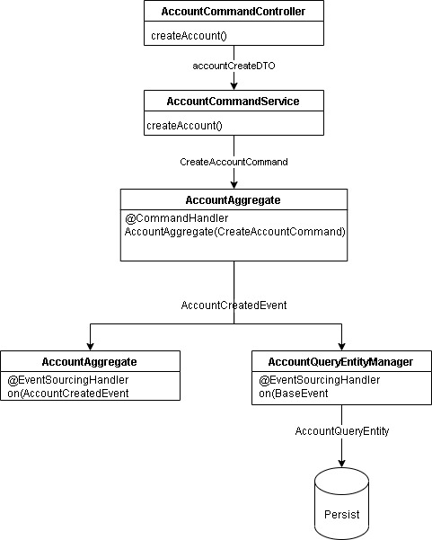

# Spring CQRS and Event Sourcing With Axon
In this example you will find a Spring project implementing [CQRS](https://docs.google.com/document/d/1Nl-01uY2qwOkfeiMySlihSKqqlsS3DFwrofJ-WgGyGY/edit#heading=h.ae2g9nf3bvzx)  and [Event Sourcing](https://docs.google.com/document/d/1Nl-01uY2qwOkfeiMySlihSKqqlsS3DFwrofJ-WgGyGY/edit#heading=h.2z220x4x1m37) with Axon frame work.

So, the idea behind this example is, we have an accounting application in which we handle next events

* Account Create Event
* Account Activate Event
* Money Credit Event
* Money Debit Event

## Architecture
Next diagram shows how the create account event pass for different layers to be persisted in an event data source in this case postgres 

## Requirements
* SpringBoot
* Axon
* Lombok
* Swagger

## Documentation
This application was created based on two tutorials

Event Sourcing
* [Event Sourcing Theory](https://progressivecoder.com/implementing-event-sourcing-with-axon-and-spring-boot-part-2//)
* [Event Sourcing Github](https://github.com/dashsaurabh/event-sourcing-cqrs-axon-spring-boot)

CQRS
* [CQRS Theory](https://progressivecoder.com/event-sourcing-and-cqrs-with-axon-and-spring-boot-part-2/)
* [CQRS Github](https://github.com/dashsaurabh/event-sourcing-axon-spring-boot)